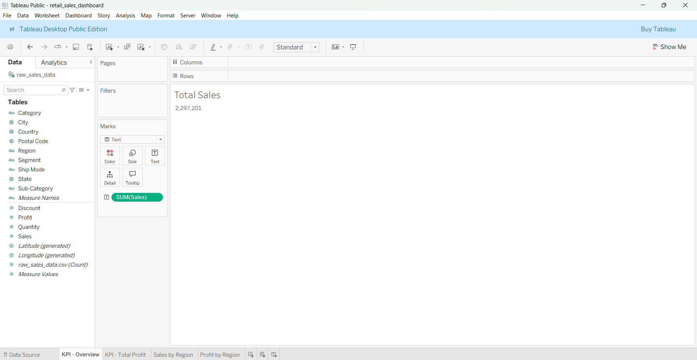
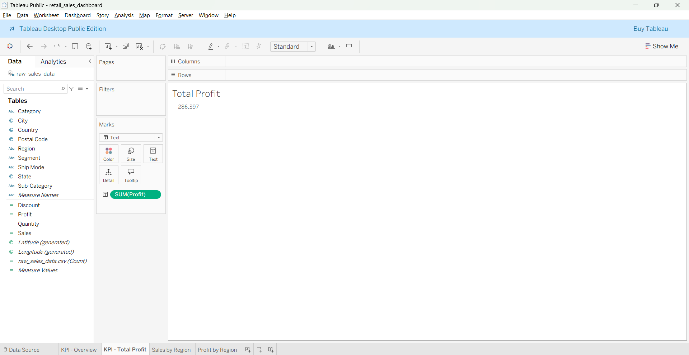
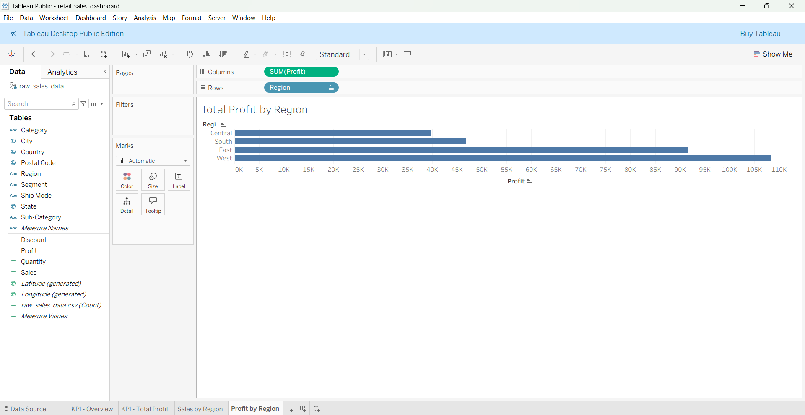
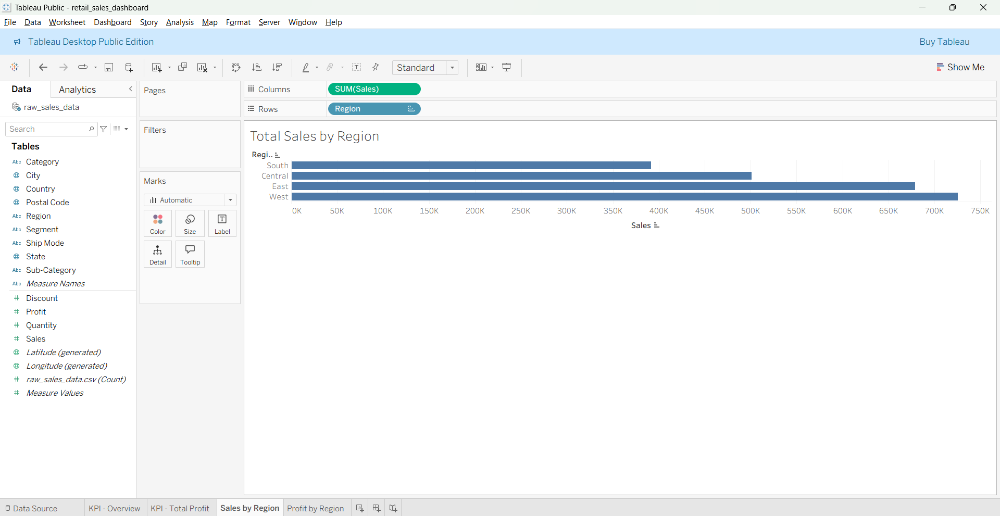
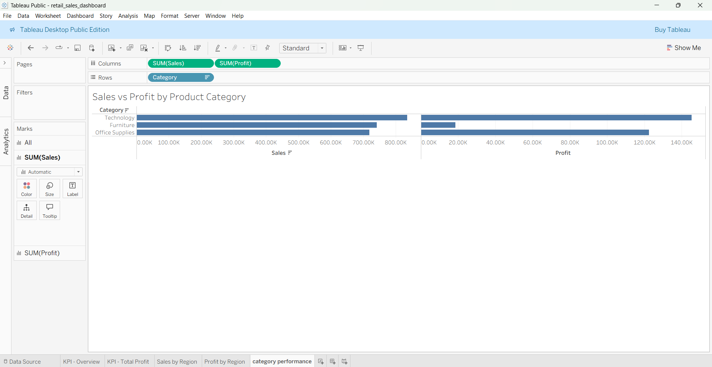
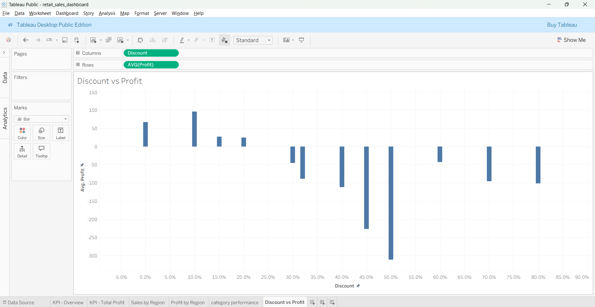
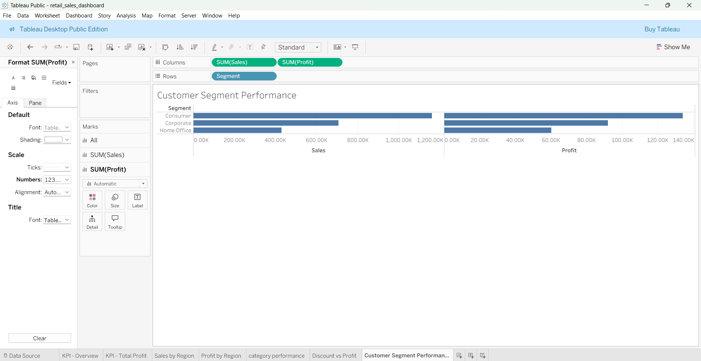

# Retail Sales Data Analytics Project

This repository contains a complete end-to-end data analytics project that turns raw sales data into **decision-ready insights** using SQL and Tableau.

The purpose of this project is to help stakeholders understand performance across regions, products, customer segments, and pricing strategies by answering key business questions.

---

## 🔍 Project Overview

The project follows a structured analytics workflow:
1. Framing business questions
2. Preparing and exploring data
3. Writing and validating SQL queries
4. Deriving business insights
5. Building an interactive Tableau dashboard
6. Publishing results publicly

---

## 📊 Business Questions Addressed

1. Which regions and cities generate the highest revenue and profit?
2. Which product categories and sub-categories are most and least profitable?
3. How do discount levels impact profitability?
4. Are there high-revenue segments or categories that are still loss-making?
5. How does customer segmentation affect sales and profit contribution?

---

## 🛠 Technologies & Tools

This project uses:

| Tool | Purpose |
|------|---------|
| MySQL | SQL querying and aggregation |
| Tableau Public | Dashboard creation and visualization |
| GitHub | Version control and project documentation |

---

## 📁 Repository Structure

```
retail-sales-data-analytics/
│
├── dashboard/        # Tableau screenshots + workbook (.twb)
├── data/             # Source dataset (raw_sales_data.csv)
├── insights/         # Written business insights
├── sql/              # SQL exploratory work + final queries
├── notebooks/        # (Optional) Jupyter notebooks if used
└── README.md         # Project documentation
```

---

## 📈 Dashboard Visuals

### KPIs

**Total Sales**  


**Total Profit**  


---

### 📍 Regional Performance

**Total Sales by Region**  


**Total Profit by Region**  


---

### 🛍 Category & Discount Impact

**Sales vs Profit by Product Category**  


**Discount vs Average Profit**  


---

### 👥 Customer Segments

**Sales & Profit by Customer Segment**  


---

## 🌐 Interactive Dashboard

The full interactive dashboard is published on Tableau Public:

👉 https://public.tableau.com/app/profile/shreya.mishra1494/viz/retail_sales_dashboard_17708159755290/RetailSalesPerformanceDashboard

---

## 💡 Key Insights Summary

- **West region** leads in both revenue and profit, highlighting geographic strength.
- **Technology products** generate highest revenue and profit; **Furniture** shows weaker margins.
- Discounts above ~30–40% sharply reduce profitability.
- **Consumer and Corporate segments** contribute the most to overall business performance.
- High sales do not always mean high profit — a key nuance for strategy.

Full analysis and interpretation are available in `insights/business_insights.md`.

---

## 🧠 How to Use This Repository

1. Explore the SQL queries in `sql/` to understand how answers were derived.  
2. Open the Tableau workbook in `dashboard/` to see how each chart is built.  
3. Review visuals in the `dashboard/` folder along with the published interactive version.  
4. Read insights in `insights/` to understand business implications.

---

## 📌 Notes

- All data used is included within this repository.
- Dashboard is publicly shareable to demonstrate work.
