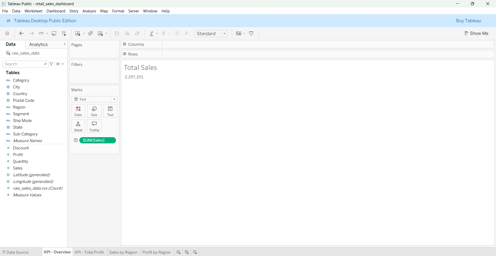
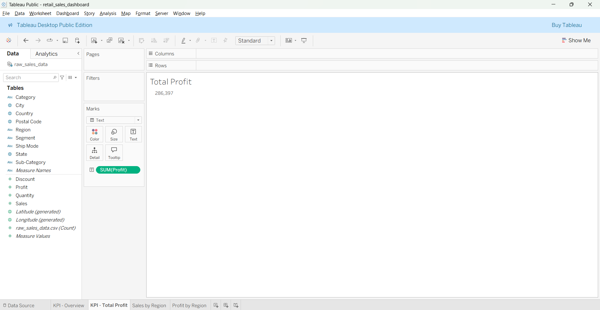
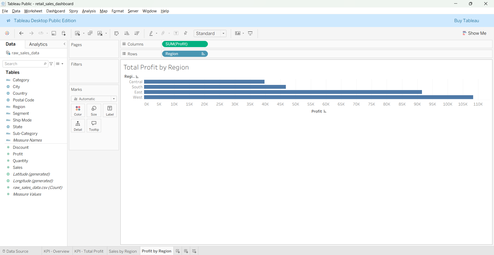
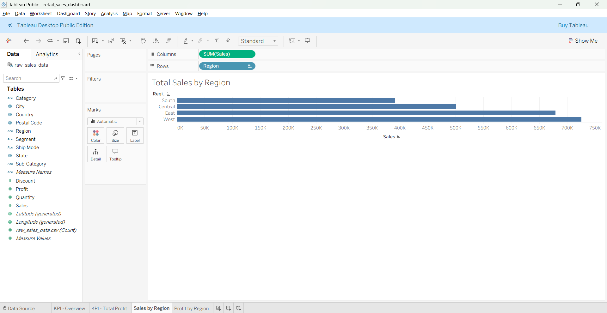

## Dashboard Design Rationale

The dashboard was designed to highlight overall performance, profitability risks,
and key drivers of revenue. Visuals were intentionally limited to focus on
decision-relevant insights rather than exhaustive analysis.

### Total Sales

Displays total revenue generated across all regions and product categories.

### Total Profit

Shows overall profitability after accounting for discounts and costs.

### Sales by Region

Highlights regional contribution to total sales.

### Profit by Region

Reveals profit differences across regions.

